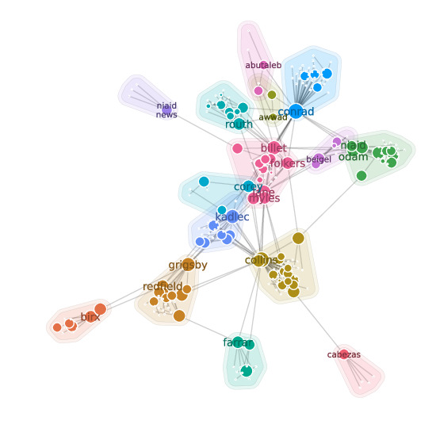

`fauci-email`: a `json` digest of Anthony Fauci's released emails
====================

A collection of over 3000 pages of emails sent by Anthony Fauci and his staff were released in an effort to understand the United States government response to the COVID-19 pandemic:

> Anthony Fauci's Emails Reveal The Pressure That Fell On One Man   
> Natalie Bettendorf and Jason Leopold    
> BuzzFeed News, June 2, 2021   
> https://www.buzzfeednews.com/article/nataliebettendorf/fauci-emails-covid-response

This repository hosts an easy-to-use `json` digest of these emails appropriate for many future types of studies along with prepackaged datasets derived from this data (networks, graphs, hypergraphs, tensors) along with simple analysis scripts to demonstrate the findings in our arXiv paper.

#### Citation

    @article{Benson-2021-fauci-emails,
      author = {Austin Benson and Nate Veldt and David F. Gleich},
      ...
    }

    @misc{Leopold-2021-fauci-emails,
      title = {Anthony Fauci’s Emails Reveal The Pressure That Fell On One Man},
      author = {Natalie Bettendorf and Jason Leopold},
      howpublished = {BuzzFeed News, \url{https://www.buzzfeednews.com/article/nataliebettendorf/fauci-emails-covid-response}},
      month = {June},
      year = {2021},
      url = {https://s3.documentcloud.org/documents/20793561/leopold-nih-foia-anthony-fauci-emails.pdf},
    }

Findings
========

Optimal modularity partitions
-----------------------------
We solve the NP-hard community detection problems using Gurobi's integer programming software. This results in the following partition of the network into communities (in a graph with Fauci removed, following structural hole theory). The heads of various federal agencies and task forces are present (Birx, Redfield, Farrar, Kadlac).

Temporal evolution
------------------

[Following this link takes you to an animation of 100 days of emails to Fauci.](figures/anim-mod.mp4)

Datasets
========

`fauci-email-graph.json`
------------------------
The raw JSON digest parsed from the PDF file. It's an array of email threads with names indexed into the name array (0-based). We hope the following schema description helps, although it may seem overly complicated

    FILE <- { "emails": EMAILS,
              "names": [ Strings ], # names for people
              "clusters": [ Integer ], # 1-based index of organization ids for each person
              "cluster_names": [ Strings ] # names for each organization
             }

    EMAILS <- [ THREAD ] # emails is an array of threads
    THREAD <- [ EMAIL ] # a thread is an array of email
    EMAIL <- { "sender": Integer, # the sender id in NAMES, 0 indexed
               "recipients": [ Integer ],  # indices into NAMES
               "cc": [ Integer ], # indices into NAMES
               "subject": String, # the subject field
               "time": TIMESTRING, # the normalized time-string
             }

    TIMESTRING <- String # An isoformat time from Python isoformat()

e.g. in python3 this will output the sender and recipient lists for each email in each thread.

    import json
    with open('fauci-email-graph.json') as f:
      data = json.loads(f.read())
    names = data["names"]
    for thread in data["emails"]:
      print("----")
      print("New Thread")
      for email in thread:
        print("--")
        print("From:", names[email["sender"]])
        print("To:", "; ".join([names[nid] for nid in email["recipients"]]))

Networks and Graphs
-------------------

There are 5 graphs we derive from the data for our analysis,
although our tools in `methods.jl` can produce additional variations.

| Graph file | nodes | simple graph  edges | simple  max degree | simple  mean degree | simple  median degree | simple  lambda2 || weighted graph  loops | weighted   volume | max weighted  degree | mean weighted  degree | median weighted  degree | weighted  lambda2 |
| ---------- | --- | --- |  --- | --- | --- | --- | ---| --- | --- |  --- | --- | --- | --- |
| `fauci-email-repliedto.json` | 46 | 58 | 18 | 2.5 | 1 | 0.0167 |  | 2 | 435 | 7 | 91 | 9.5 | 3 | 0.0082 |
| `fauci-email-hypergraph-projection.json` w/o CC | 366 | 2580 | 263 | 14.1 | 6 | 0.0536 |  | 0 | 13072 | 0 | 1985 | 35.7 | 12 | 0.0346 |
| `fauci-email-hypergraph-projection-cc.json` with CC | 869 | 7140 | 685 | 16.4 | 7 | 0.0826 |  | 0 | 76420 | 0 | 4473 | 87.9 | 11 | 0.0254 |
| `fauci-email-tofrom-5.json` w/o CC | 233 | 324 | 44 | 2.8 | 1 | 0.0324 |  | 2 | 1164 | 2 | 102 | 5.0 | 2 | 0.0305 |
|`fauci-email-tofrom-cc-5.json` with CC | 386 | 588 | 97 | 3.0 | 2 | 0.0457 |  | 9 | 2179 | 15 | 248 | 5.6 | 2 | 0.0316 |

- `fauci-email-repliedto.json`: This is a weighted network that enumerates _replied-to_ relationships. We have an edge from `u` to `v` if `u` replied to `v`'s email and then weight the edge with the largest number of interactions in either direction. We remove Fauci from this view of the network to study the view without his emails. This network is an instance of a temporal motif network using a "replied-to" temporal motif. We then remove everyone outside of the largest connected component.
- `fauci-email-tofrom-5.json`: This is a weighted network that has an edge between the sender and recipients of an email (excluding the CC list), weighted by the largest number of interactions in either direction. In this network, we remove emails with more than 5 recipients to focus on _work_ behavior instead of _broadcast_ behavior. This omits, for instance, weekly emails that detail spending of newly allocated funds to address the pandemic that were often sent to around 20 individuals. We also remove everyone outside the largest connected component.
- `fauci-email-tofrom-cc-5.json`:  This is the same network above, but expanded to include the CC lists in the number of recipients. The same limit of 5 recipients applies.
- `fauci-email-hypergraph-projection.json`:  This is a weighted network that is a network projection of the email hypergraph where each email indicates a hyperedge among the sender and recipients. We then form the clique projection of the hypergraph, where each hyperedge induces a fully connected set of edges among all participants. The weight on an edge in the network are the number of hyperedges that share that edge. The graph is naturally undirected. Because this omits CC lists from each hyperedge, the graph can easily be disconnected if an email arrived via a CC edge. To focus the data analysis, we remove any individual who has only a single edge in the graph (with any weight).
- `fauci-email-hypergraph-projection-cc.json`: This version of the network adds CCed recipients to the hyperedge for each email.

We designed these graphs to be easy to read in a variety of software. They can be read as JSON files, but are also simple enough to parse without any JSON libraries.

    {
      "vertices": <number of vertices>,
      "edges": <number of edges>,
      "edgedata": [
        <src1>, <dst1>, <weight1>,
        <src2>, <dst2>, <weight2>,
        ...
        <src_number_of_edges>, <dst_number_of_edges>, <weight_number_of_edges>
      ],
      "labels": [
        <list of labels, one per vertex>
      ],
      "orgs": [
        <list of organizations, one per vertex>
      ]
    }

 For instance, to use them with the [SNAP package](https://snap.stanford.edu/) a few shell commands suffice

    $ tail -n +5 fauci-email-tofrom-5.json | sed -n '/],/q;p' | sed 's/,//g' | cut -f1,2 -d" " | less

Or to read them without any JSON package in python3

    with open("fauci-email-repliedto.json", "r") as f:
      f.readline() # read the first '{'
      nverts = int(f.readline().split(':')[1].split(',')[0])
      nedges = int(f.readline().split(':')[1].split(',')[0])
      f.readline() # read "edgedata"
      src, dst, weights = [],[],[]
      for _ in range(nedges):
        einfo = f.readline().split(",")
        src.append(int(einfo[0]))
        dst.append(int(einfo[1]))
        weights.append(int(einfo[2]))
      f.readline() # read end array
      f.readline() # read label array start
      labels = []
      for _ in range(nverts):
        labels.append(f.readline().strip().strip(",").strip('"'))
      f.readline() # read label array end
      f.readline() # read org array start
      orgs = []
      for _ in range(nverts):
        orgs.append(int(f.readline().strip().strip(",")))
